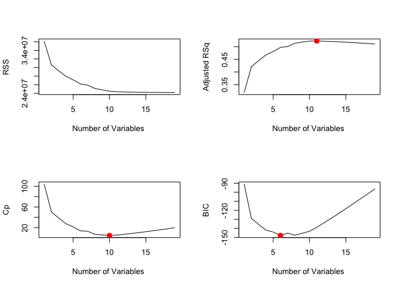
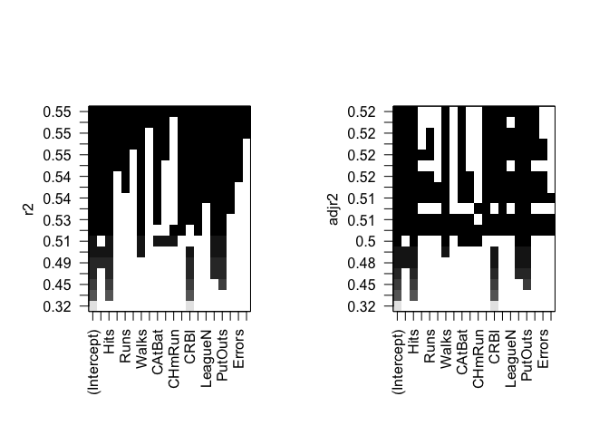
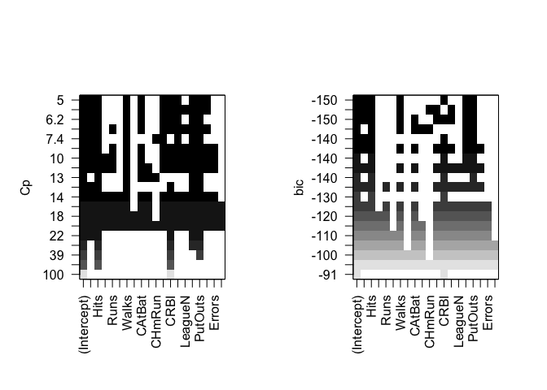
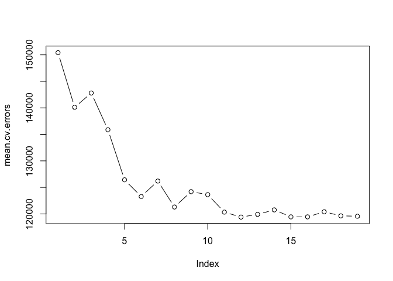

Predict Baseball Player Salary
================
Irene N. Chang
04/04/2020

We wish to use different Linear Model selection techniques to predict a
baseball player’s salary based on previous year’s statistics.

First, we take a look at the datasaet. There are some missing values in
the dataset, we will omit such observations

``` r
library(ISLR)
names(Hitters)
```

    ##  [1] "AtBat"     "Hits"      "HmRun"     "Runs"      "RBI"      
    ##  [6] "Walks"     "Years"     "CAtBat"    "CHits"     "CHmRun"   
    ## [11] "CRuns"     "CRBI"      "CWalks"    "League"    "Division" 
    ## [16] "PutOuts"   "Assists"   "Errors"    "Salary"    "NewLeague"

``` r
dim(Hitters)
```

    ## [1] 322  20

``` r
sum(is.na(Hitters$Salary))
```

    ## [1] 59

Check again to make sure we no longer have any missing values

``` r
Hitters=na.omit(Hitters)
dim(Hitters)
```

    ## [1] 263  20

``` r
sum(is.na(Hitters))
```

    ## [1] 0

### Best Subset Selection

Use regsubsets() function to perform best subset selection by
identifying the best model that contains a given number of predictors

``` r
library(leaps)
regfit <- regsubsets(Salary ~., Hitters, nvmax=19)
regfit.summary=summary(regfit)
regfit.summary
```

    ## Subset selection object
    ## Call: regsubsets.formula(Salary ~ ., Hitters, nvmax = 19)
    ## 19 Variables  (and intercept)
    ##            Forced in Forced out
    ## AtBat          FALSE      FALSE
    ## Hits           FALSE      FALSE
    ## HmRun          FALSE      FALSE
    ## Runs           FALSE      FALSE
    ## RBI            FALSE      FALSE
    ## Walks          FALSE      FALSE
    ## Years          FALSE      FALSE
    ## CAtBat         FALSE      FALSE
    ## CHits          FALSE      FALSE
    ## CHmRun         FALSE      FALSE
    ## CRuns          FALSE      FALSE
    ## CRBI           FALSE      FALSE
    ## CWalks         FALSE      FALSE
    ## LeagueN        FALSE      FALSE
    ## DivisionW      FALSE      FALSE
    ## PutOuts        FALSE      FALSE
    ## Assists        FALSE      FALSE
    ## Errors         FALSE      FALSE
    ## NewLeagueN     FALSE      FALSE
    ## 1 subsets of each size up to 19
    ## Selection Algorithm: exhaustive
    ##           AtBat Hits HmRun Runs RBI Walks Years CAtBat CHits CHmRun CRuns
    ## 1  ( 1 )  " "   " "  " "   " "  " " " "   " "   " "    " "   " "    " "  
    ## 2  ( 1 )  " "   "*"  " "   " "  " " " "   " "   " "    " "   " "    " "  
    ## 3  ( 1 )  " "   "*"  " "   " "  " " " "   " "   " "    " "   " "    " "  
    ## 4  ( 1 )  " "   "*"  " "   " "  " " " "   " "   " "    " "   " "    " "  
    ## 5  ( 1 )  "*"   "*"  " "   " "  " " " "   " "   " "    " "   " "    " "  
    ## 6  ( 1 )  "*"   "*"  " "   " "  " " "*"   " "   " "    " "   " "    " "  
    ## 7  ( 1 )  " "   "*"  " "   " "  " " "*"   " "   "*"    "*"   "*"    " "  
    ## 8  ( 1 )  "*"   "*"  " "   " "  " " "*"   " "   " "    " "   "*"    "*"  
    ## 9  ( 1 )  "*"   "*"  " "   " "  " " "*"   " "   "*"    " "   " "    "*"  
    ## 10  ( 1 ) "*"   "*"  " "   " "  " " "*"   " "   "*"    " "   " "    "*"  
    ## 11  ( 1 ) "*"   "*"  " "   " "  " " "*"   " "   "*"    " "   " "    "*"  
    ## 12  ( 1 ) "*"   "*"  " "   "*"  " " "*"   " "   "*"    " "   " "    "*"  
    ## 13  ( 1 ) "*"   "*"  " "   "*"  " " "*"   " "   "*"    " "   " "    "*"  
    ## 14  ( 1 ) "*"   "*"  "*"   "*"  " " "*"   " "   "*"    " "   " "    "*"  
    ## 15  ( 1 ) "*"   "*"  "*"   "*"  " " "*"   " "   "*"    "*"   " "    "*"  
    ## 16  ( 1 ) "*"   "*"  "*"   "*"  "*" "*"   " "   "*"    "*"   " "    "*"  
    ## 17  ( 1 ) "*"   "*"  "*"   "*"  "*" "*"   " "   "*"    "*"   " "    "*"  
    ## 18  ( 1 ) "*"   "*"  "*"   "*"  "*" "*"   "*"   "*"    "*"   " "    "*"  
    ## 19  ( 1 ) "*"   "*"  "*"   "*"  "*" "*"   "*"   "*"    "*"   "*"    "*"  
    ##           CRBI CWalks LeagueN DivisionW PutOuts Assists Errors NewLeagueN
    ## 1  ( 1 )  "*"  " "    " "     " "       " "     " "     " "    " "       
    ## 2  ( 1 )  "*"  " "    " "     " "       " "     " "     " "    " "       
    ## 3  ( 1 )  "*"  " "    " "     " "       "*"     " "     " "    " "       
    ## 4  ( 1 )  "*"  " "    " "     "*"       "*"     " "     " "    " "       
    ## 5  ( 1 )  "*"  " "    " "     "*"       "*"     " "     " "    " "       
    ## 6  ( 1 )  "*"  " "    " "     "*"       "*"     " "     " "    " "       
    ## 7  ( 1 )  " "  " "    " "     "*"       "*"     " "     " "    " "       
    ## 8  ( 1 )  " "  "*"    " "     "*"       "*"     " "     " "    " "       
    ## 9  ( 1 )  "*"  "*"    " "     "*"       "*"     " "     " "    " "       
    ## 10  ( 1 ) "*"  "*"    " "     "*"       "*"     "*"     " "    " "       
    ## 11  ( 1 ) "*"  "*"    "*"     "*"       "*"     "*"     " "    " "       
    ## 12  ( 1 ) "*"  "*"    "*"     "*"       "*"     "*"     " "    " "       
    ## 13  ( 1 ) "*"  "*"    "*"     "*"       "*"     "*"     "*"    " "       
    ## 14  ( 1 ) "*"  "*"    "*"     "*"       "*"     "*"     "*"    " "       
    ## 15  ( 1 ) "*"  "*"    "*"     "*"       "*"     "*"     "*"    " "       
    ## 16  ( 1 ) "*"  "*"    "*"     "*"       "*"     "*"     "*"    " "       
    ## 17  ( 1 ) "*"  "*"    "*"     "*"       "*"     "*"     "*"    "*"       
    ## 18  ( 1 ) "*"  "*"    "*"     "*"       "*"     "*"     "*"    "*"       
    ## 19  ( 1 ) "*"  "*"    "*"     "*"       "*"     "*"     "*"    "*"

``` r
regfit.summary$rsq
```

    ##  [1] 0.3214501 0.4252237 0.4514294 0.4754067 0.4908036 0.5087146 0.5141227
    ##  [8] 0.5285569 0.5346124 0.5404950 0.5426153 0.5436302 0.5444570 0.5452164
    ## [15] 0.5454692 0.5457656 0.5459518 0.5460945 0.5461159

We see that the R-squared statistic increases from 32 %, when only one
variable is included in the model, to almost 55%, when all variables are
included. R2 statistic increases monotonically as more variables are
included. In fact, the performance reaches a plateau and even goes down
after the 11th variable. We will now plot a red dot to indicate the
model with the largest adjusted R2 statistic.

``` r
#plot statistics against number of variables
par(mfrow=c(2,2))
plot(regfit.summary$rss ,xlab="Number of Variables ",ylab="RSS",
             type="l")
plot(regfit.summary$adjr2 ,xlab="Number of Variables ",
             ylab="Adjusted RSq",type="l")
which.max(regfit.summary$adjr2)
```

    ## [1] 11

``` r
points(11,regfit.summary$adjr2[11], col="red",cex=2,pch=20)

plot(regfit.summary$cp ,xlab="Number of Variables ",ylab="Cp", type="l")
which.min(regfit.summary$cp)
```

    ## [1] 10

``` r
points(10,regfit.summary$cp [10],col="red",cex=2,pch=20)
which.min(regfit.summary$bic)
```

    ## [1] 6

``` r
plot(regfit.summary$bic ,xlab="Number of Variables ",ylab="BIC",
         type="l")
points(6,regfit.summary$bic [6],col="red",cex=2,pch=20)
```

<!-- -->

``` r
par(mfrow=c(2,2))
#plot to see which subset size is best
plot(regfit, scale="r2")
plot(regfit,scale="adjr2")
plot(regfit,scale="Cp")
plot(regfit,scale="bic")
#see the coefficients
coef(regfit,6)
```





    ##  (Intercept)        AtBat         Hits        Walks         CRBI 
    ##   91.5117981   -1.8685892    7.6043976    3.6976468    0.6430169 
    ##    DivisionW      PutOuts 
    ## -122.9515338    0.2643076

### Forward and Backward Stewise Selection

``` r
#forward backward
regfit.fwd=regsubsets (Salary ~.,data=Hitters ,nvmax=19, method ="forward")
summary(regfit.fwd)
```

    ## Subset selection object
    ## Call: regsubsets.formula(Salary ~ ., data = Hitters, nvmax = 19, method = "forward")
    ## 19 Variables  (and intercept)
    ##            Forced in Forced out
    ## AtBat          FALSE      FALSE
    ## Hits           FALSE      FALSE
    ## HmRun          FALSE      FALSE
    ## Runs           FALSE      FALSE
    ## RBI            FALSE      FALSE
    ## Walks          FALSE      FALSE
    ## Years          FALSE      FALSE
    ## CAtBat         FALSE      FALSE
    ## CHits          FALSE      FALSE
    ## CHmRun         FALSE      FALSE
    ## CRuns          FALSE      FALSE
    ## CRBI           FALSE      FALSE
    ## CWalks         FALSE      FALSE
    ## LeagueN        FALSE      FALSE
    ## DivisionW      FALSE      FALSE
    ## PutOuts        FALSE      FALSE
    ## Assists        FALSE      FALSE
    ## Errors         FALSE      FALSE
    ## NewLeagueN     FALSE      FALSE
    ## 1 subsets of each size up to 19
    ## Selection Algorithm: forward
    ##           AtBat Hits HmRun Runs RBI Walks Years CAtBat CHits CHmRun CRuns
    ## 1  ( 1 )  " "   " "  " "   " "  " " " "   " "   " "    " "   " "    " "  
    ## 2  ( 1 )  " "   "*"  " "   " "  " " " "   " "   " "    " "   " "    " "  
    ## 3  ( 1 )  " "   "*"  " "   " "  " " " "   " "   " "    " "   " "    " "  
    ## 4  ( 1 )  " "   "*"  " "   " "  " " " "   " "   " "    " "   " "    " "  
    ## 5  ( 1 )  "*"   "*"  " "   " "  " " " "   " "   " "    " "   " "    " "  
    ## 6  ( 1 )  "*"   "*"  " "   " "  " " "*"   " "   " "    " "   " "    " "  
    ## 7  ( 1 )  "*"   "*"  " "   " "  " " "*"   " "   " "    " "   " "    " "  
    ## 8  ( 1 )  "*"   "*"  " "   " "  " " "*"   " "   " "    " "   " "    "*"  
    ## 9  ( 1 )  "*"   "*"  " "   " "  " " "*"   " "   "*"    " "   " "    "*"  
    ## 10  ( 1 ) "*"   "*"  " "   " "  " " "*"   " "   "*"    " "   " "    "*"  
    ## 11  ( 1 ) "*"   "*"  " "   " "  " " "*"   " "   "*"    " "   " "    "*"  
    ## 12  ( 1 ) "*"   "*"  " "   "*"  " " "*"   " "   "*"    " "   " "    "*"  
    ## 13  ( 1 ) "*"   "*"  " "   "*"  " " "*"   " "   "*"    " "   " "    "*"  
    ## 14  ( 1 ) "*"   "*"  "*"   "*"  " " "*"   " "   "*"    " "   " "    "*"  
    ## 15  ( 1 ) "*"   "*"  "*"   "*"  " " "*"   " "   "*"    "*"   " "    "*"  
    ## 16  ( 1 ) "*"   "*"  "*"   "*"  "*" "*"   " "   "*"    "*"   " "    "*"  
    ## 17  ( 1 ) "*"   "*"  "*"   "*"  "*" "*"   " "   "*"    "*"   " "    "*"  
    ## 18  ( 1 ) "*"   "*"  "*"   "*"  "*" "*"   "*"   "*"    "*"   " "    "*"  
    ## 19  ( 1 ) "*"   "*"  "*"   "*"  "*" "*"   "*"   "*"    "*"   "*"    "*"  
    ##           CRBI CWalks LeagueN DivisionW PutOuts Assists Errors NewLeagueN
    ## 1  ( 1 )  "*"  " "    " "     " "       " "     " "     " "    " "       
    ## 2  ( 1 )  "*"  " "    " "     " "       " "     " "     " "    " "       
    ## 3  ( 1 )  "*"  " "    " "     " "       "*"     " "     " "    " "       
    ## 4  ( 1 )  "*"  " "    " "     "*"       "*"     " "     " "    " "       
    ## 5  ( 1 )  "*"  " "    " "     "*"       "*"     " "     " "    " "       
    ## 6  ( 1 )  "*"  " "    " "     "*"       "*"     " "     " "    " "       
    ## 7  ( 1 )  "*"  "*"    " "     "*"       "*"     " "     " "    " "       
    ## 8  ( 1 )  "*"  "*"    " "     "*"       "*"     " "     " "    " "       
    ## 9  ( 1 )  "*"  "*"    " "     "*"       "*"     " "     " "    " "       
    ## 10  ( 1 ) "*"  "*"    " "     "*"       "*"     "*"     " "    " "       
    ## 11  ( 1 ) "*"  "*"    "*"     "*"       "*"     "*"     " "    " "       
    ## 12  ( 1 ) "*"  "*"    "*"     "*"       "*"     "*"     " "    " "       
    ## 13  ( 1 ) "*"  "*"    "*"     "*"       "*"     "*"     "*"    " "       
    ## 14  ( 1 ) "*"  "*"    "*"     "*"       "*"     "*"     "*"    " "       
    ## 15  ( 1 ) "*"  "*"    "*"     "*"       "*"     "*"     "*"    " "       
    ## 16  ( 1 ) "*"  "*"    "*"     "*"       "*"     "*"     "*"    " "       
    ## 17  ( 1 ) "*"  "*"    "*"     "*"       "*"     "*"     "*"    "*"       
    ## 18  ( 1 ) "*"  "*"    "*"     "*"       "*"     "*"     "*"    "*"       
    ## 19  ( 1 ) "*"  "*"    "*"     "*"       "*"     "*"     "*"    "*"

``` r
regfit.bwd=regsubsets (Salary ~.,data=Hitters ,nvmax=19,
                                                 method ="backward")
summary(regfit.bwd)
```

    ## Subset selection object
    ## Call: regsubsets.formula(Salary ~ ., data = Hitters, nvmax = 19, method = "backward")
    ## 19 Variables  (and intercept)
    ##            Forced in Forced out
    ## AtBat          FALSE      FALSE
    ## Hits           FALSE      FALSE
    ## HmRun          FALSE      FALSE
    ## Runs           FALSE      FALSE
    ## RBI            FALSE      FALSE
    ## Walks          FALSE      FALSE
    ## Years          FALSE      FALSE
    ## CAtBat         FALSE      FALSE
    ## CHits          FALSE      FALSE
    ## CHmRun         FALSE      FALSE
    ## CRuns          FALSE      FALSE
    ## CRBI           FALSE      FALSE
    ## CWalks         FALSE      FALSE
    ## LeagueN        FALSE      FALSE
    ## DivisionW      FALSE      FALSE
    ## PutOuts        FALSE      FALSE
    ## Assists        FALSE      FALSE
    ## Errors         FALSE      FALSE
    ## NewLeagueN     FALSE      FALSE
    ## 1 subsets of each size up to 19
    ## Selection Algorithm: backward
    ##           AtBat Hits HmRun Runs RBI Walks Years CAtBat CHits CHmRun CRuns
    ## 1  ( 1 )  " "   " "  " "   " "  " " " "   " "   " "    " "   " "    "*"  
    ## 2  ( 1 )  " "   "*"  " "   " "  " " " "   " "   " "    " "   " "    "*"  
    ## 3  ( 1 )  " "   "*"  " "   " "  " " " "   " "   " "    " "   " "    "*"  
    ## 4  ( 1 )  "*"   "*"  " "   " "  " " " "   " "   " "    " "   " "    "*"  
    ## 5  ( 1 )  "*"   "*"  " "   " "  " " "*"   " "   " "    " "   " "    "*"  
    ## 6  ( 1 )  "*"   "*"  " "   " "  " " "*"   " "   " "    " "   " "    "*"  
    ## 7  ( 1 )  "*"   "*"  " "   " "  " " "*"   " "   " "    " "   " "    "*"  
    ## 8  ( 1 )  "*"   "*"  " "   " "  " " "*"   " "   " "    " "   " "    "*"  
    ## 9  ( 1 )  "*"   "*"  " "   " "  " " "*"   " "   "*"    " "   " "    "*"  
    ## 10  ( 1 ) "*"   "*"  " "   " "  " " "*"   " "   "*"    " "   " "    "*"  
    ## 11  ( 1 ) "*"   "*"  " "   " "  " " "*"   " "   "*"    " "   " "    "*"  
    ## 12  ( 1 ) "*"   "*"  " "   "*"  " " "*"   " "   "*"    " "   " "    "*"  
    ## 13  ( 1 ) "*"   "*"  " "   "*"  " " "*"   " "   "*"    " "   " "    "*"  
    ## 14  ( 1 ) "*"   "*"  "*"   "*"  " " "*"   " "   "*"    " "   " "    "*"  
    ## 15  ( 1 ) "*"   "*"  "*"   "*"  " " "*"   " "   "*"    "*"   " "    "*"  
    ## 16  ( 1 ) "*"   "*"  "*"   "*"  "*" "*"   " "   "*"    "*"   " "    "*"  
    ## 17  ( 1 ) "*"   "*"  "*"   "*"  "*" "*"   " "   "*"    "*"   " "    "*"  
    ## 18  ( 1 ) "*"   "*"  "*"   "*"  "*" "*"   "*"   "*"    "*"   " "    "*"  
    ## 19  ( 1 ) "*"   "*"  "*"   "*"  "*" "*"   "*"   "*"    "*"   "*"    "*"  
    ##           CRBI CWalks LeagueN DivisionW PutOuts Assists Errors NewLeagueN
    ## 1  ( 1 )  " "  " "    " "     " "       " "     " "     " "    " "       
    ## 2  ( 1 )  " "  " "    " "     " "       " "     " "     " "    " "       
    ## 3  ( 1 )  " "  " "    " "     " "       "*"     " "     " "    " "       
    ## 4  ( 1 )  " "  " "    " "     " "       "*"     " "     " "    " "       
    ## 5  ( 1 )  " "  " "    " "     " "       "*"     " "     " "    " "       
    ## 6  ( 1 )  " "  " "    " "     "*"       "*"     " "     " "    " "       
    ## 7  ( 1 )  " "  "*"    " "     "*"       "*"     " "     " "    " "       
    ## 8  ( 1 )  "*"  "*"    " "     "*"       "*"     " "     " "    " "       
    ## 9  ( 1 )  "*"  "*"    " "     "*"       "*"     " "     " "    " "       
    ## 10  ( 1 ) "*"  "*"    " "     "*"       "*"     "*"     " "    " "       
    ## 11  ( 1 ) "*"  "*"    "*"     "*"       "*"     "*"     " "    " "       
    ## 12  ( 1 ) "*"  "*"    "*"     "*"       "*"     "*"     " "    " "       
    ## 13  ( 1 ) "*"  "*"    "*"     "*"       "*"     "*"     "*"    " "       
    ## 14  ( 1 ) "*"  "*"    "*"     "*"       "*"     "*"     "*"    " "       
    ## 15  ( 1 ) "*"  "*"    "*"     "*"       "*"     "*"     "*"    " "       
    ## 16  ( 1 ) "*"  "*"    "*"     "*"       "*"     "*"     "*"    " "       
    ## 17  ( 1 ) "*"  "*"    "*"     "*"       "*"     "*"     "*"    "*"       
    ## 18  ( 1 ) "*"  "*"    "*"     "*"       "*"     "*"     "*"    "*"       
    ## 19  ( 1 ) "*"  "*"    "*"     "*"       "*"     "*"     "*"    "*"

``` r
#nhận xét: ở best subset thì ở mỗi subset size sẽ có những combination khác nhau, còn ở forward and backward thì các variable sẽ luôn xuất hiện từ lúc bắt đầu đc select, aka có một variable sẽ luôn có dấu *
```

Variable models for forward selection are identical to best selection up
to the 6th variable.

``` r
coef(regfit ,7)
```

    ##  (Intercept)         Hits        Walks       CAtBat        CHits 
    ##   79.4509472    1.2833513    3.2274264   -0.3752350    1.4957073 
    ##       CHmRun    DivisionW      PutOuts 
    ##    1.4420538 -129.9866432    0.2366813

``` r
coef(regfit.fwd ,7)
```

    ##  (Intercept)        AtBat         Hits        Walks         CRBI 
    ##  109.7873062   -1.9588851    7.4498772    4.9131401    0.8537622 
    ##       CWalks    DivisionW      PutOuts 
    ##   -0.3053070 -127.1223928    0.2533404

``` r
coef(regfit.bwd ,7)
```

    ##  (Intercept)        AtBat         Hits        Walks        CRuns 
    ##  105.6487488   -1.9762838    6.7574914    6.0558691    1.1293095 
    ##       CWalks    DivisionW      PutOuts 
    ##   -0.7163346 -116.1692169    0.3028847

### Choosing Among Models Using the Validation Set Approach and Cross-Validation

#### Validation set approach

``` r
#using cross-validation instead of statistics - just tham khảo vì nó chưa đúng
set.seed (1)
train=sample(c(TRUE,FALSE), nrow(Hitters),replace = TRUE)
test =(! train )
regfit.best=regsubsets(Salary ~.,data=Hitters[train,], nvmax =19)
test.mat=model.matrix(Salary~.,data=Hitters[test,])
val.errors=rep(NA,19)
for(i in 1:19){
    coefi=coef(regfit.best,id=i)
    pred=test.mat[,names(coefi)]%*%coefi
    val.errors[i]=mean((Hitters$Salary[test]-pred)^2)
}
val.errors
```

    ##  [1] 164377.3 144405.5 152175.7 145198.4 137902.1 139175.7 126849.0
    ##  [8] 136191.4 132889.6 135434.9 136963.3 140694.9 140690.9 141951.2
    ## [15] 141508.2 142164.4 141767.4 142339.6 142238.2

We find that the best model is the one that contains 10 variables.

``` r
coef(regfit.best ,10)
```

    ##  (Intercept)        AtBat         Hits        HmRun        Walks 
    ##   71.8074075   -1.5038124    5.9130470  -11.5241809    8.4349759 
    ##       CAtBat        CRuns         CRBI       CWalks    DivisionW 
    ##   -0.1654850    1.7064330    0.7903694   -0.9107515 -109.5616997 
    ##      PutOuts 
    ##    0.2426078

To try cross validation approach, we first make our own predict function
that includes the analysis steps above

``` r
predict.regsubsets<- function(model, newdata, id,...){
    form = as.formula(model$call[[2]])
    mat = model.matrix(form, newdata)
    coefi = coef(model, id = id) # id: which model out of 19 models obtained
    xvars = names(coefi)
    mat[,xvars]%*%coefi
}
```

#### Cross validation

``` r
k = 4
set.seed(4)
folds=sample(1:k,nrow(Hitters),replace=TRUE)
cv.errors=matrix(NA,k,19, dimnames=list(NULL, paste(1:19)))

for(j in 1:k){
    best.fit = regsubsets(Salary ~., data = Hitters[folds!=j,], nvmax=19)
    for (i in 1:19){ 
        pred = predict(best.fit,Hitters[folds==j,],id=i)
        cv.errors[j, i]= mean((Hitters$Salary[folds==j]-pred)^2)
    }
}
cv.errors
```

    ##             1        2        3        4        5        6        7
    ## [1,] 150037.4 134912.5 132705.1 119973.6 106462.5  98519.3  99557.8
    ## [2,] 193240.2 192034.8 187430.4 178541.6 188931.9 179582.6 175627.6
    ## [3,] 135971.0 120168.8 115574.3 110631.1 107400.7 104607.4 125274.9
    ## [4,] 122394.4 113341.8 135491.4 134381.7 102917.0 110413.9 104324.9
    ##              8         9        10        11        12        13        14
    ## [1,]  84004.15  87413.05  82887.68  83015.04  85782.22  86111.93  85058.55
    ## [2,] 169255.18 170508.17 168205.31 167519.88 169656.48 169768.77 170936.99
    ## [3,] 122982.68 133574.12 133721.25 134668.06 133574.55 134539.78 135480.10
    ## [4,] 108962.79 105295.06 109705.66  96150.74  88583.13  89236.84  91557.43
    ##            15        16        17        18        19
    ## [1,]  84793.6  84789.42  84688.37  84410.80  84500.52
    ## [2,] 170157.8 170155.38 170873.51 169775.39 169655.71
    ## [3,] 132005.3 131680.48 135378.49 134444.33 134580.82
    ## [4,]  90811.2  91135.66  90683.32  89911.67  89511.60

This has given us a 10×19 matrix, of which the (i, j)th element
corresponds to the test MSE for the ith cross-validation fold for the
best j-variable model

``` r
mean.cv.errors=apply(cv.errors ,2,mean)
mean.cv.errors
```

    ##        1        2        3        4        5        6        7        8 
    ## 150410.8 140114.5 142800.3 135882.0 126428.0 123280.8 126196.3 121301.2 
    ##        9       10       11       12       13       14       15       16 
    ## 124197.6 123630.0 120338.4 119399.1 119914.3 120758.3 119442.0 119440.2 
    ##       17       18       19 
    ## 120405.9 119635.5 119562.2

``` r
par(mfrow=c(1,1))
plot(mean.cv.errors ,type='b')
```

<!-- -->

We see that cross-validation selects an 11-variable model.
